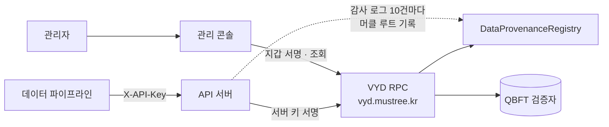

# VYD Data Provenance

**VYD 전용 메인넷 위에서 데이터 가공 이력을 기록하고, SHA-256 해시로 진위를 검증하는 시스템**

데이터를 수집 → 전처리 → AI 가공 → 품질 검증 → 라이선스 단계로 처리할 때마다 산출물 해시를 체인에 남깁니다. 각 단계는 직전 단계 해시와 연결되므로, 나중에 파일 하나만 있어도 원본인지, 어느 단계의 결과물인지, 중간에 바뀌었는지를 확인할 수 있습니다. 원본 데이터와 개인정보는 체인에 올리지 않고 해시와 메타데이터 위치만 기록합니다.

빈야드 매니지먼트 블록체인 바우처 과제의 산출물입니다.

| 구성 | 위치 | 역할 |
|---|---|---|
| 스마트컨트랙트 | `contracts/` | 단계별 이력 기록, 진위 검증, 권한 관리, 감사 로그 앵커 |
| API 서버 | `api-server/` | 데이터 파이프라인·포털이 호출하는 REST API (서버 키로 서명) |
| 관리 콘솔 | `console/` | 지갑 연결, 블록 탐색, 노드 관제, 이력 등록·조회·검증 화면 |

## 네트워크

| 항목 | 값 |
|---|---|
| 네트워크 이름 | `VYD` |
| 기본 RPC URL | `https://vyd.mustree.kr` |
| 체인 ID | `7603` |
| 통화 기호 | `VYD` (가스 계산 전용, 외부 발행·거래 없음) |
| 블록 탐색기 URL | 없음. 관리 콘솔의 블록 탐색기를 씁니다 |

MetaMask에 직접 추가할 때는 RPC URL에 `https://`를 꼭 붙이세요. 콘솔의 **지갑·연결** 화면에서 “네트워크 추가”를 눌러도 같은 값이 등록됩니다.

## 구조



```
.
├─ contracts/DataProvenanceRegistry.sol   이력·진위검증 스마트컨트랙트
├─ artifacts/                             컴파일 결과 (ABI, 바이트코드)
├─ scripts/
│  ├─ compile.mjs                         solc 0.8.24 컴파일
│  ├─ deploy.mjs                          배포 + 권한 부여
│  ├─ build-console.mjs                   콘솔 빌드 (ABI·소스·기본 설정 삽입)
│  ├─ check-network.mjs                   RPC·컨트랙트 연결 확인
│  └─ serve-console.mjs                   콘솔 로컬 서버 (localhost:5173)
├─ test/contract.test.mjs                 로컬 체인 컨트랙트 테스트
├─ api-server/                            REST API (Express + ethers v6)
├─ console/
│  ├─ src.html                            콘솔 소스
│  └─ index.html                          빌드 결과. 이 파일 하나만 올리면 됩니다
└─ .github/workflows/                     CI, Pages, 컨트랙트·API 배포
```

## 이력 기록 방식

```
DS-2026-0040  수집 ──▶ 전처리 ──▶ AI 가공 ──▶ 품질 검증 ──▶ 라이선스
              hashA     hashB      hashC       hashD         hashE
              parent=0  parent=A   parent=B    parent=C      parent=D
```

- **등록:** `registerRecord(dataId, stage, contentHash, metaURI)`를 호출하면 직전 단계 해시가 `parentHash`로 자동 연결됩니다.
- **거절 조건:** 같은 콘텐츠 해시는 원장 전체에서 한 번만 등록됩니다(`DuplicateHash`). 현재 단계보다 앞 단계는 등록할 수 없습니다(`InvalidStageOrder`).
- **진위 검증:** `verify(contentHash)`가 일치 여부, 데이터 ID, 해당 단계 이력을 돌려줍니다. 읽기 호출이라 수수료가 없습니다.
- **권한:** OpenZeppelin AccessControl을 씁니다.
  - `REGISTRAR_ROLE`: 이력 등록
  - `AUDITOR_ROLE`: 감사 로그 앵커 기록
  - `DEFAULT_ADMIN_ROLE`: 권한 부여·회수
- **이벤트 로그:** `RecordRegistered` 이벤트에 dataId 원문, 해시, parentHash, 메타데이터 URI, 시각이 모두 남습니다. 콘솔과 API는 이 이벤트만으로 전체 이력을 복원합니다.

## 빠른 시작

Node.js 20 이상이 필요합니다. Windows·macOS·Linux 모두 같은 명령으로 동작합니다.

```bash
npm install
npm run build      # 컨트랙트 컴파일 + console/index.html 생성
npm test           # 로컬 체인에서 등록·검증·권한·앵커 테스트
npm run check      # VYD RPC 연결 확인 (체인 ID·최신 블록·피어·검증자)
npm run console    # 콘솔을 http://localhost:5173 으로 열기
```

`npm run check`에서 컨트랙트까지 확인하려면 `CONTRACT_ADDRESS`를 넘기세요.

```powershell
$env:CONTRACT_ADDRESS="0x…"; npm run check          # Windows PowerShell
```

```bash
CONTRACT_ADDRESS=0x… npm run check                    # macOS·Linux
```

콘솔은 RPC에 연결되지 않으면 예시 데이터로 동작하는 시뮬레이션 모드로 표시됩니다. MetaMask는 `file://`로 연 페이지에는 붙지 않습니다. 반드시 `npm run console`로 열어 주세요.

## 배포

### GitHub Actions

| 워크플로 | 실행 시점 | 하는 일 |
|---|---|---|
| **CI** | main 푸시, PR | 컴파일, 컨트랙트 테스트, 콘솔 빌드, API 문법 검사 |
| **Deploy console** | main 푸시(콘솔·컨트랙트 변경 시), 수동 | 콘솔을 GitHub Pages에 배포 |
| **Deploy contract** | 수동만 | 컨트랙트 배포 + 권한 부여. 실행할 때마다 새 주소가 생깁니다 |
| **Deploy API server** | main 푸시(api-server 변경 시), 수동 | SSH로 운영 서버에 올리고 pm2 재시작 |

**최초 설정**

1. **Pages:** Settings → Pages → Source를 **GitHub Actions**로 바꿉니다.
2. **환경:** Settings → Environments에서 `production` 환경을 만듭니다. 승인자를 지정하면 배포 전에 승인을 거칩니다.
3. **Secrets:** 아래 세 값을 등록합니다.

   | 이름 | 내용 |
   |---|---|
   | `DEPLOYER_PRIVATE_KEY` | 컨트랙트 배포 계정 개인키 |
   | `SSH_PRIVATE_KEY` | 운영 서버 배포용 SSH 키 |
   | `SSH_KNOWN_HOSTS` | `ssh-keyscan -p 22 <서버>` 출력 |

4. **Variables:** 아래 값을 등록합니다.

   | 이름 | 예 | 용도 |
   |---|---|---|
   | `RPC_URL` | `https://vyd.mustree.kr` | 컨트랙트 배포 |
   | `GAS_PRICE` | `0` 또는 비움 | 무료 가스 네트워크면 0 |
   | `CONSOLE_CONTRACT` | `0x…` | 콘솔 기본 컨트랙트 주소 |
   | `CONSOLE_DEPLOY_BLOCK` | `12345` | 콘솔 이벤트 조회 시작 블록 |
   | `CONSOLE_API` | `https://api.vyd.mustree.kr/v1` | 콘솔 기본 API 주소 |
   | `SSH_HOST` · `SSH_USER` · `SSH_PORT` | `api.vyd.mustree.kr` · `deploy` · `22` | API 서버 접속 |
   | `DEPLOY_PATH` | `/opt/vyd` | 서버 설치 경로 |
   | `API_HEALTH_URL` | `https://api.vyd.mustree.kr/health` | 배포 후 확인 (선택) |

5. **컨트랙트 배포:** Actions → **Deploy contract** → Run workflow를 엽니다. 확인란에 `deploy`를 입력하고, registrars·auditors에 API 서버 계정 주소를 넣어 실행합니다.
6. **콘솔 반영:** 실행 요약에 나온 주소·블록을 `CONSOLE_CONTRACT`, `CONSOLE_DEPLOY_BLOCK`에 넣고 **Deploy console**을 다시 실행합니다.
7. **API 서버:** 운영 서버에 Node.js 22와 pm2를 설치하고 `<DEPLOY_PATH>/api-server/.env`를 만든 뒤 **Deploy API server**를 실행합니다.
8. **CORS:** Geth의 `--http.corsdomain`과 API 서버의 `CORS_ORIGIN`에 콘솔 주소(예: `https://<계정>.github.io`)를 추가합니다.

> `vyd.mustree.kr` RPC가 IP 허용 목록으로 막혀 있다면 GitHub 호스팅 러너가 접속할 수 없습니다. 사내망에 self-hosted runner를 두고 `runs-on: self-hosted`로 바꾸세요.

### 직접 배포

```bash
# 컨트랙트
RPC_URL=https://vyd.mustree.kr \
PRIVATE_KEY=0x<배포 계정 개인키> \
REGISTRARS=0x<API 서버 계정> \
AUDITORS=0x<API 서버 계정> \
npm run deploy                   # → deployments/chain-7603.json

# API 서버
cd api-server && npm install
cp .env.example .env             # CONTRACT_ADDRESS, PRIVATE_KEY, API_KEYS 입력
npm start                        # :8080/v1
```

관리 콘솔의 **스마트컨트랙트** 화면에서 지갑으로 배포해도 됩니다. 이때는 연결된 지갑이 관리자가 됩니다.

## API

인증은 `X-API-Key` 헤더로 합니다. 키별 권한(`write`, `read`, `verify`)은 `.env`의 `API_KEYS`에서 정합니다.

| 메서드 | 경로 | 권한 | 설명 |
|---|---|---|---|
| GET | `/v1/network/status` | read | 체인·컨트랙트 상태 |
| GET | `/v1/records` | read | 데이터셋 목록 |
| POST | `/v1/records` | write | 이력 등록 → `202` + txHash |
| GET | `/v1/records/{dataId}` | read | 최신 상태 |
| GET | `/v1/records/{dataId}/history` | read | 전체 이력 + 해시 체인 무결성 |
| POST | `/v1/verify` | verify | 진위 검증 (`MATCH` · `MISMATCH` · `NOT_FOUND`) |
| GET | `/v1/transactions/{txHash}` | read | 트랜잭션 상태 |
| GET | `/v1/audit-logs` | read | 감사 로그 (`limit`, `type`, `fromSeq`) |
| GET | `/v1/audit-anchors` | read | 온체인 앵커 목록 |
| GET | `/v1/audit-anchors/{i}/verify` | read | 앵커 머클 루트 재검증 |

```bash
curl -X POST https://api.vyd.mustree.kr/v1/verify \
  -H "X-API-Key: $VYD_API_KEY" -H "Content-Type: application/json" \
  -d '{"contentHash":"0x4b4ce322...1e21","dataId":"DS-2026-0031"}'
```

오류 코드는 다음과 같습니다.

| HTTP | 코드 |
|---|---|
| 400 | `INVALID_*` |
| 401 | `UNAUTHORIZED` |
| 403 | `FORBIDDEN_SCOPE` · `FORBIDDEN_ROLE` |
| 404 | `NOT_FOUND` |
| 409 | `DUPLICATE_HASH` |
| 422 | `STAGE_ORDER` |
| 429 | `RATE_LIMITED` |
| 503 | `CHAIN_UNAVAILABLE` |

**감사 로그 앵커링:** 모든 요청은 `data/audit.jsonl`에 기록됩니다. 10건마다 머클 루트를 계산해 `anchorAuditLog`로 체인에 남기므로, 로그가 나중에 수정되면 재검증에서 드러납니다. 계산 규칙은 아래와 같고, 콘솔도 같은 규칙으로 브라우저에서 검증합니다.

```
leaf = sha256(JSON.stringify([seq, ts, type, actor, action, target, result, tx]))
node = sha256(leftHex + rightHex.slice(2))     // 홀수 개면 마지막 노드 복제
```

## 노드 설정

VYD 노드는 Geth입니다. 브라우저 콘솔이 RPC를 직접 호출하려면 콘솔 주소를 CORS로 허용해야 합니다.

```
--http --http.addr 0.0.0.0 --http.api eth,net,web3,clique
--http.corsdomain "http://localhost:5173,https://<계정>.github.io"
--http.vhosts "*"
--metrics --metrics.addr 0.0.0.0 --metrics.port 6060
```

- `vyd.mustree.kr` 앞에 nginx 같은 프록시가 있다면 거기서 `Access-Control-Allow-Origin` 헤더를 붙여도 됩니다.
- CORS를 열 수 없으면 콘솔은 연결된 지갑(VYD 네트워크 선택 상태)을 거쳐 조회합니다.

## 산출물 대응표

| 계약사항 | 산출물 | 위치 |
|---|---|---|
| (1) 메인넷 | 전용 메인넷 (Chain ID · RPC · 네이티브 코인) | 네트워크 정보, 콘솔 **지갑·연결 / 메인넷 정보** |
| (1) 메인넷 | 노드·관제 환경 | 콘솔 **노드·관제**, Prometheus 설정 |
| (1) 메인넷 | 구축 내역서 · 접속 정보 · 구성 내역 | 콘솔 **메인넷 정보**의 구축 내역 요약 |
| (2) 이력·진위검증 | 스마트컨트랙트 소스 및 배포 내역 | `contracts/`, `deployments/`, 콘솔 **스마트컨트랙트** |
| (2) 이력·진위검증 | 이력 등록·조회·진위검증 API 명세 | `api-server/`, 이 문서의 API 절, 콘솔 **API 명세** |
| (2) 이력·진위검증 | 라이프사이클 이력화 · 온체인 기록 · 감사 로그 | 콘솔 **이력 조회 / 감사 로그**, `anchorAuditLog` |

## 보안

- 개인키와 `.env`는 커밋하지 않습니다. GitHub에서는 Secrets에만 둡니다.
- 컨트랙트 생성자는 관리자에게 등록·감사 권한도 함께 줍니다. 운영 전환 후 필요 없으면 콘솔에서 회수하세요.
- 컨트랙트 배포 워크플로는 실수로 재배포되지 않게 수동 실행과 `deploy` 입력 확인을 거칩니다.
- API 서버는 HTTPS 리버스 프록시 뒤에 두고, `CORS_ORIGIN`을 콘솔 도메인으로 좁힙니다.

## 기술 스택

- **컨트랙트:** Solidity 0.8.24, OpenZeppelin Contracts 5.0.2, EVM london
- **API 서버:** Node.js 22, Express 4, ethers 6
- **콘솔:** 빌드 없는 단일 HTML, ethers 6 (CDN)
- **노드:** Geth 1.13
- **테스트:** ganache 7 (프로세스 내장 체인)

## 라이선스

비공개 (UNLICENSED). 빈야드 매니지먼트 블록체인 바우처 과제 산출물입니다.
